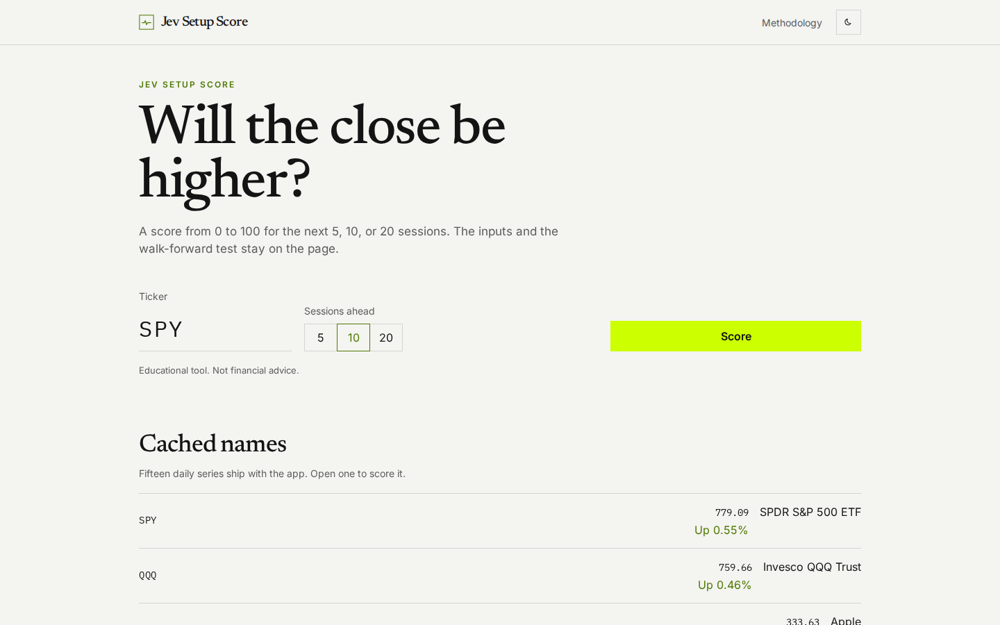
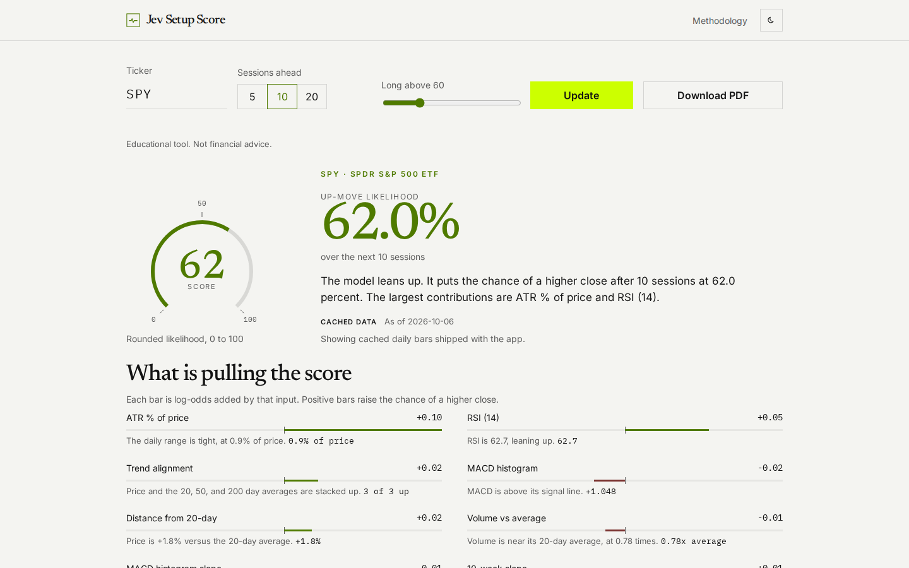
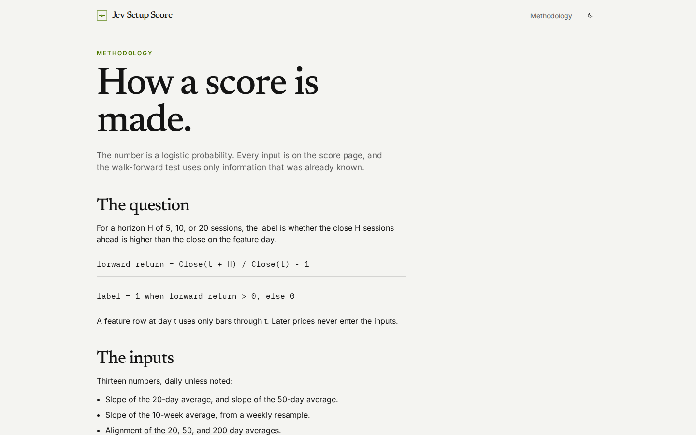
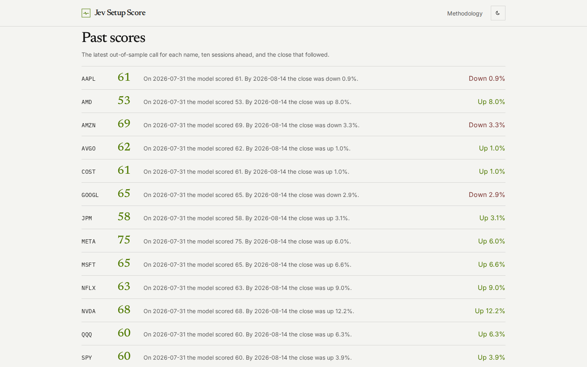
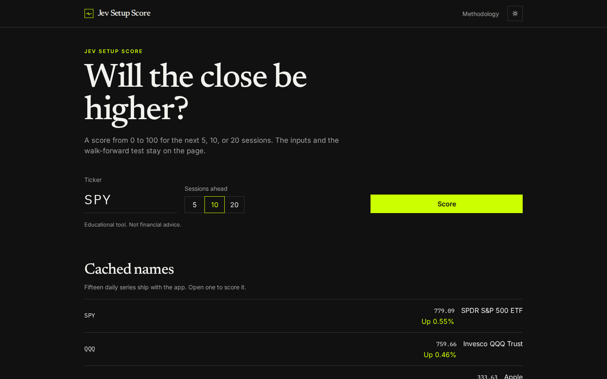
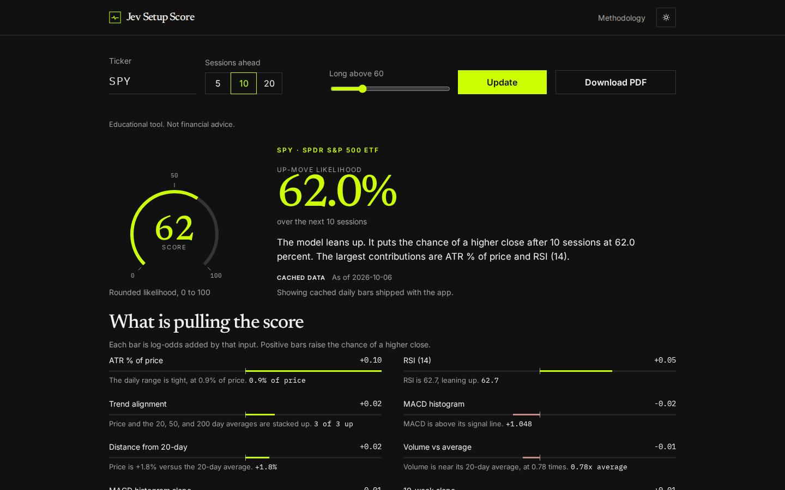
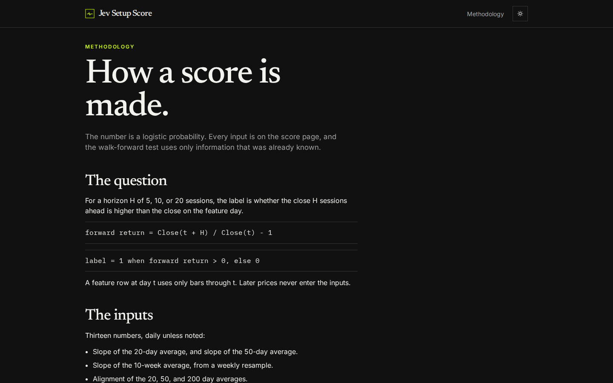
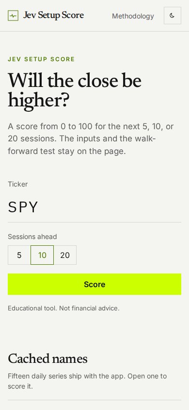
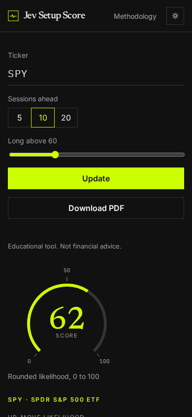
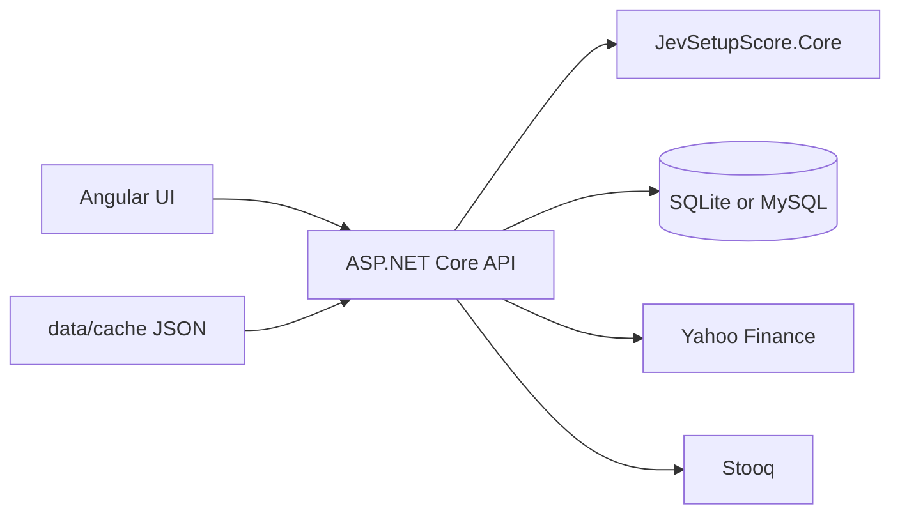

# Jev Setup Score



Type a ticker. The app returns a 0 to 100 setup score and the chance the close is higher after 5, 10, or 20 sessions.

Educational tool. Not financial advice.

## Screenshot tour

Light mode, desktop.








Dark mode, desktop.







Phone width, light and dark.





## What it does

- Daily features, plus a weekly resample: 20-day and 50-day moving-average slopes, 10-week slope, alignment of the 20, 50, and 200 day averages, RSI(14), MACD(12, 26, 9) histogram and its slope, ATR(14) as a percent of price, volume versus its 20-day average, distance from the 20, 50, and 200 day averages, and the 10-session return.
- A logistic regression in C#. No paid data and no paid model. The label is a forward return above zero. The page shows coefficients and the current contribution of each input.
- The score is that probability times 100. Each factor has a short plain-English read.
- A walk-forward backtest on the page: rolling train and test windows, hit rate, Brier score, a calibration chart, the base rate, and an equity curve for a long-when-score-is-above-threshold rule against buy and hold. The copy says so when the model does not clearly beat the base rate.
- A price chart with moving averages, plus RSI and MACD panels.
- Live daily bars from Yahoo Finance, then Stooq, then the cached files. The page says whether the result used live or cached data.
- Cached bars for 15 names: SPY, QQQ, AAPL, NVDA, TSLA, MSFT, AMZN, GOOGL, META, AMD, JPM, NFLX, AVGO, COST, and WMT.
- A home section of real past scores: the newest out-of-sample call for each name, and what the close did afterward.
- A methodology page with the formulas.
- Light and dark mode. The toggle is remembered. With no saved choice, the app follows the system theme. Color changes ease over 280ms.
- A PDF report of the score.
- Local history of score lookups, in SQLite by default or MySQL when you select it.
- A small Ulric wordmark in the footer. The app name leads in the header.

## Motion

Entrances fade and rise 12px over 340ms, with a short stagger, on `cubic-bezier(.2, .7, .2, 1)`. Route changes crossfade the page and leave the header in place. Scores, the likelihood, and the walk-forward stats count up. The gauge, factor bars, and charts draw in when they scroll into view. The RSI wash and the equity area fill after the line.

The methodology page draws an SVG of the path from bars to a score, including the train and test windows. Under that, a three.js surface (r170) shows the logistic probability over two inputs. Drag to orbit. three.js loads only with that view, the pixel ratio is capped at 2, and the render loop pauses when the canvas leaves the screen.

`prefers-reduced-motion` makes those changes instant, skips the 3D loop, and keeps the still drawing of the surface.

## Architecture



`JevSetupScore.Core` holds the indicators, the feature rows, logistic regression, and the walk-forward split. The API imports `data/cache` on startup, optionally refreshes a ticker from Yahoo or Stooq, trains one logistic model per horizon, and runs the walk-forward test. The Angular app renders the score, the factor bars, the charts, and the test. QuestPDF writes the same numbers to a PDF.

`Database:Provider` selects the store. `Sqlite` is the default and needs no extra service. `MySql` uses Pomelo EF Core. Each provider has its own migrations. Startup calls `Database.Migrate()` and then seeds ticker names and any cached bars that are not already stored. Each score request is written to `ScoreQueries`.

## The model

The label for horizon H is whether the close H sessions ahead is higher.

```text
forward return = Close(t + H) / Close(t) - 1
label = 1 when forward return > 0, else 0
```

A feature row at day t uses only bars through t. RSI and ATR use Wilder smoothing. MACD uses an EMA seeded with a simple average.

Training rows are standardized:

```text
z = (x - mean) / standard deviation
```

The probability is a logistic regression. Weights are per one standard deviation. The intercept is not penalized. Training is Newton / IRLS on an L2-penalized log likelihood.

```text
P(up) = 1 / (1 + exp(-(intercept + sum of weight * z)))
score = round(P(up) * 100)
```

The walk-forward test uses a train window of 504 sessions and a test window of 63. A training row is eligible only when its label bar is strictly before the test window:

```text
featureBarIndex + horizon < testStartBarIndex
```

Hit rate uses 0.5 as the cut. Brier score is the mean squared error of the probability. Both sit next to the base rate of up closes in the same test rows. The equity rule is long when the rounded score is above the threshold, otherwise flat. Trades do not overlap. It is compared with buy and hold.

The full write-up is also in the app at `/methodology`.

## API

| Method | Path | Purpose |
| --- | --- | --- |
| GET | `/api/health` | Liveness. Returns `{ "status": "ok" }`. |
| GET | `/api/tickers` | The 15 cached names, last close, and daily change. |
| GET | `/api/examples` | Newest out-of-sample score per name, horizon 10, with the later close. |
| GET | `/api/history?limit=12` | Recent score lookups stored in the database. `limit` is 1 to 50. |
| GET | `/api/score/{ticker}?horizon=10&threshold=60` | Score, factors, chart, and walk-forward report. |
| GET | `/api/score/{ticker}/report.pdf?horizon=10&threshold=60` | The same score as a PDF. |

`horizon` is 5, 10, or 20. `threshold` is 50 to 90. Unknown tickers return 404 with the cached list. Swagger is at `/swagger` when the environment is Development.

## Stack

- ASP.NET Core 8 Web API
- Angular, standalone components and signals
- SQLite with EF Core, or MySQL with Pomelo, selected by config
- QuestPDF Community license for the PDF report
- ECharts for the price, oscillator, calibration, and equity charts
- xUnit for indicator math, logistic convergence, the walk-forward split, and the shipped cache files

## Run with zero config

API:

```bash
dotnet run --project src/JevSetupScore.Api
```

The API listens on http://localhost:5080 and uses SQLite file `jev.db`. Swagger is at http://localhost:5080/swagger in Development.

UI:

```bash
cd web
npm install
npm start
```

Open http://localhost:4200. The dev server proxies `/api` to port 5080.

Tests:

```bash
dotnet test
```

## Deploy under MAMP

Apache serves the UI at `http://localhost:8888/apps/jev-setup-score/`. The API is proxied from that same prefix. MAMP's MySQL is 5.7.39 on `127.0.0.1` port `8889`. The example user is `root` and the placeholder password is `CHANGE_ME`. That pair lives only in `.env.example` and `src/JevSetupScore.Api/appsettings.Development.example.json`. Do not commit a real password.

### Build the UI for the sub-path

```bash
cd web
npm install
npm run build:mamp
```

That is `ng build --base-href /apps/jev-setup-score/`. Copy the files in `web/dist/mamp-check/browser/` into the Apache directory for `/apps/jev-setup-score/`.

The page `<base href>` is that prefix with a trailing slash. Router links, scripts, styles, and the favicon are relative to it. Every API call in the app is a relative `api/...` URL, including the PDF download, so the browser requests `http://localhost:8888/apps/jev-setup-score/api/...`. A leading slash (`/api/...`) would skip the prefix and is not used.

`npm run build` without `build:mamp` keeps `<base href="/">` for Docker and for `ng serve`.

### Apache

Proxy the API and let client routes fall back to `index.html`. Adjust the Kestrel port if you did not use 5080.

```apache
ProxyPreserveHost On
ProxyPass /apps/jev-setup-score/api/ http://127.0.0.1:5080/api/
ProxyPassReverse /apps/jev-setup-score/api/ http://127.0.0.1:5080/api/

RewriteEngine On
RewriteBase /apps/jev-setup-score/
RewriteRule ^api/ - [L]
RewriteCond %{REQUEST_FILENAME} !-f
RewriteCond %{REQUEST_FILENAME} !-d
RewriteRule . /apps/jev-setup-score/index.html [L]
```

This proxy strips the site prefix, so Kestrel still sees `/api/...`. Leave `PathBase` empty. Set `PathBase` to `/apps/jev-setup-score` only if the proxy forwards that prefix through to Kestrel.

`PublicBaseUrl` is how the API builds absolute links (the `reportUrl` field and the Swagger server). For this deploy set:

```text
PublicBaseUrl=http://localhost:8888/apps/jev-setup-score
```

Leave `PublicBaseUrl` empty and the API emits a relative `api/score/.../report.pdf` link, which the browser resolves with the base href.

### MySQL 5.7

1. Start MySQL in MAMP.
2. Create the database with utf8mb4:

```sql
CREATE DATABASE jev_setup_score CHARACTER SET utf8mb4 COLLATE utf8mb4_unicode_ci;
```

3. Copy the example settings and switch the provider:

```bash
cp src/JevSetupScore.Api/appsettings.Development.example.json src/JevSetupScore.Api/appsettings.Development.json
```

Set `"Database": { "Provider": "MySql", "MySqlVersion": "5.7.39-mysql" }`. The example connection string is:

```text
Server=127.0.0.1;Port=8889;Database=jev_setup_score;User=root;Password=CHANGE_ME;CharSet=utf8mb4;SslMode=None
```

`appsettings.Development.json` and `.env` are gitignored.

4. Start the API. On startup it calls `ServerVersion.AutoDetect` when MySQL accepts a connection, and uses `Database:MySqlVersion` only if that connection fails. It then applies migrations and seeds cached bars. Migrations use `utf8mb4` and `utf8mb4_unicode_ci`. They do not use MySQL 8 collations, JSON columns, or descending indexes. `datetime(6)` is valid on 5.7.39. New MySQL migrations are generated against server version `5.7.39-mysql`, so a newer local server does not rewrite them with MySQL 8 SQL.

`dotnet run` with no provider set stays on SQLite. An older `jev.db` created before migrations existed should be deleted so `Migrate()` can create `__EFMigrationsHistory`. If a MySQL database already has the first migration from before the 5.7 collation change, drop that database and let startup create it again.

### Sub-path check

Automated:

```bash
cd web
npm run check:subpath
```

The script refuses absolute `api` URLs in the Angular source, builds with the MAMP base href, and serves that build under `/apps/jev-setup-score/`. It checks the base tag, that scripts stay inside the prefix, that `/methodology` falls back to the shell, and that a PDF href resolves to `/apps/jev-setup-score/api/score/SPY/report.pdf`.

Manual, with the API already on port 5080:

1. Run `npm run check:subpath` and leave the printed origin, or serve `web/dist/mamp-check/browser` with any static server mounted at `/apps/jev-setup-score/` that proxies `api` to `http://127.0.0.1:5080` and falls back to `index.html`.
2. Open `http://127.0.0.1:<port>/apps/jev-setup-score/`.
3. In the network panel, confirm ticker and score calls go to `.../jev-setup-score/api/...`.
4. Open a score and use Download PDF. The link stays under the same prefix.
5. Refresh on `.../jev-setup-score/methodology` and confirm the shell loads.

## Docker

From the repository root:

```bash
docker compose up --build
```

Compose starts MySQL 8.4 and the app. The app uses `Database__Provider=MySql` and talks to the `mysql` service on port 3306. Startup detects the server version when the connection works. The database password defaults to the placeholder `CHANGE_ME` through `MYSQL_ROOT_PASSWORD`. Override it in your shell or in a local `.env` if you want a different one. Open http://localhost:8080.

MySQL 5.7, the same major version as MAMP, is a Compose profile. It publishes host port 3307 and does not replace the 8.4 service:

```bash
docker compose --profile mysql57 up -d mysql57
```

Point the API at it with `Database__Provider=MySql`, `Database__MySqlVersion=5.7.39-mysql`, and `Server=127.0.0.1;Port=3307;Database=jev_setup_score;User=root;Password=CHANGE_ME;CharSet=utf8mb4;SslMode=None`. Startup migrates and seeds that database.

The image includes the cached bars. If Yahoo or Stooq cannot be reached, scores for the cached tickers still load. Set `Data__AllowLiveFetch=false` in `docker-compose.yml` to skip live calls.

Running the image by itself, without compose, keeps the SQLite default.

## Environment variables

| Variable | Purpose | Default |
| --- | --- | --- |
| `ASPNETCORE_ENVIRONMENT` | `Development` or `Production` | `Development` for `dotnet run` |
| `ASPNETCORE_URLS` | Bind address | `http://localhost:5080` in the launch profile, `http://+:8080` in Docker |
| `Database__Provider` | `Sqlite` or `MySql` | `Sqlite` |
| `Database__MySqlVersion` | Fallback Pomelo version when AutoDetect cannot connect. MAMP is `5.7.39-mysql`. Compose sets `8.4.0-mysql` for the MySQL 8.4 service | `5.7.39-mysql` |
| `PublicBaseUrl` | Prefix for links the API writes, such as the PDF URL and Swagger. Empty keeps those links relative (`api/...`) | empty |
| `PathBase` | Path prefix Kestrel should strip. Set this only when the proxy forwards the prefix. Leave empty when Apache strips it | empty |
| `ConnectionStrings__Default` | SQLite file | `Data Source=jev.db` |
| `ConnectionStrings__MySql` | MySQL connection string. Required only when the provider is MySql | empty |
| `MYSQL_ROOT_PASSWORD` | Password for the compose MySQL service | `CHANGE_ME` |
| `Data__CacheDirectory` | Folder of cached JSON bars. Empty uses `data/cache` in the repo, or `/app/data/cache` in Docker | empty |
| `Data__AllowLiveFetch` | Try Yahoo, then Stooq, before cached bars | `true` |
| `Data__YahooBaseUrl` | Yahoo chart endpoint prefix | `https://query1.finance.yahoo.com/v8/finance/chart/` |
| `Data__StooqBaseUrl` | Stooq daily CSV prefix | `https://stooq.com/q/d/l/` |
| `Data__HttpTimeoutSeconds` | Live request timeout | `8` |
| `Cors__Origins__0` | Browser origin allowed to call the API | `http://localhost:4200` |

See `.env.example` and `src/JevSetupScore.Api/appsettings.Development.example.json`. No API keys are required. Do not commit a filled `.env`.

## Tests and CI

```bash
dotnet test JevSetupScore.sln --configuration Release
```

The suite checks RSI, MACD, and ATR against known series, logistic convergence on a synthetic set, that features do not look ahead, that a walk-forward row is trained only after its label is known, that all 15 cache files are ordered daily bars, that report links stay relative unless `PublicBaseUrl` is set, and that the MySQL migrations stay on utf8mb4 without MySQL 8-only SQL. GitHub Actions runs that suite, `npm run build`, and `npm run check:subpath`.

## Disclaimer

Educational tool. Not financial advice. Scores are model probabilities on daily bars. They are not a recommendation to buy, sell, or hold anything.
